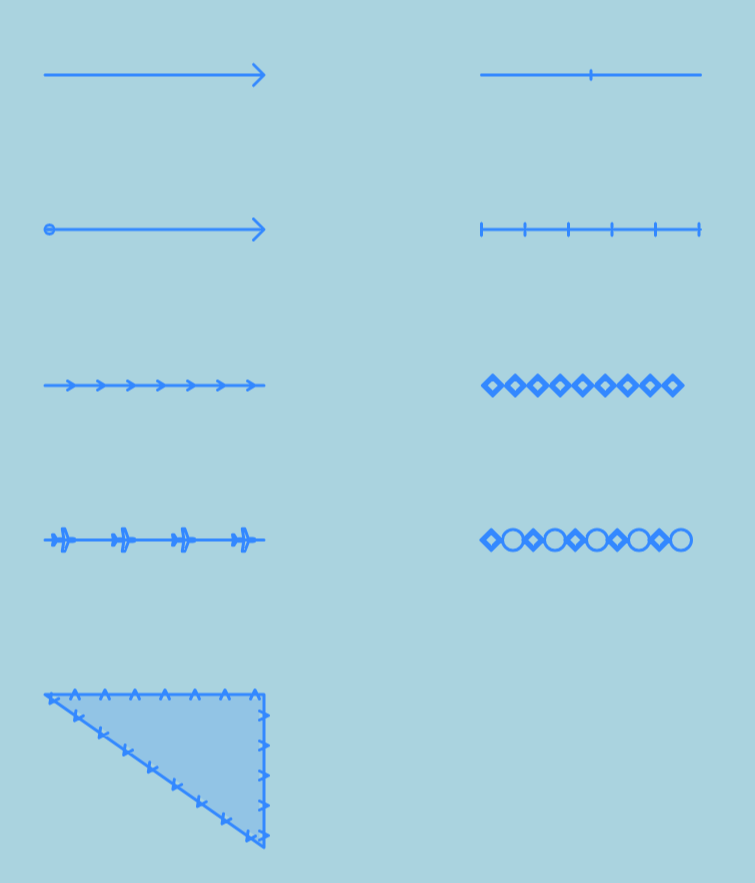

# leaflet-line-pattern

leaflet-line-pattern is a leaflet plugin that enables more options for how a line should be drawn, such as adding arrowheads or tick marks.

Check out the [live demo](https://tjasz.github.io/leaflet-line-pattern/).



## Getting Started

### Install

`npm i leaflet-line-pattern`

### Import

`import SvgPatternRenderer from "leaflet-line-pattern";`

### Using the renderer

Simply pass the renderer as an option to your Leaflet map.

```
const map = new L.Map("map", {
  renderer: new SvgPatternRenderer(),
})
```

Then, include the "pattern" option in your layer style.

```
{
  color: "red",
  weight: 1,
  pattern: "M0 0L3 5M0 0L-3 5,20,20,T",
}
```

### Pattern definitions

Patterns are defined with a semicolon-separated string of one or more pattern parts. Each part is a comma-separated string of four parameters:

1. The SVG path commands defining the image to be repeated along the line.
   The direction of travel of the line is the negative Y direction of the path.
1. An offset after which to start repeating the pattern part. This can be defined
   with just a number (pixels) or with a percentage of the line length.
   Default: 0.
1. The repetition interval of the pattern part. This can be defined
   with just a number (pixels) or with a percentage of the line length.
   Default: 100%.
1. A "T" or "F" indicating a boolean flag. If any pattern part has "T" here,
   the underlying line will be drawn.
   If all parts of a pattern have "F" here, the pattersn will be repeated along
   the line, but it will not be drawn.
   Default: "F".
   _Note: does not apply to polygons. The line will be drawn regardless, so it can be filled._

#### Example

A single tick mark in the middle of the line could be defined by:

> "M-3 0 3 0,50%,,T"

- path: horizontal line of length 6
- offset: 50%
- interval: 0
- line: traced

Note that this will be the middle of the displayed line.
If only a portion of the line is in view, Leaflet will clip it,
so the tick mark may not be at the geographic middle mark.

Because the pattern path is defined with negative Y as the direction of travel,
if a horizontal line is drawn with this pattern,
the pattern path will be rotated to be a vertical tick mark.


